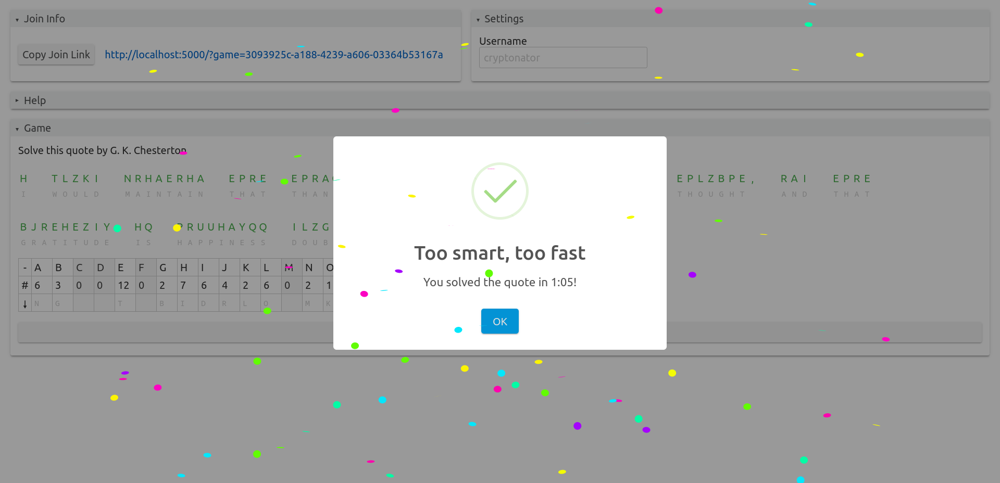

# Cryptoduel

[Play Game!](https://r2dev2.github.io/cryptoduel)

A multiplayer cryptogram game where the fastest cryptogram solver wins!



## How To Play

An aristocrat cryptogram is a quote encrypted by substituting each letter with another letter.

In cryptoduel, you compete with friends to see who can decrypt the quote the fastest!
Just go to https://r2dev2.github.io/cryptoduel and send a friend a join link!

The table given shows the amount of times each character appears in the quote as well as the replacement for each character. You may either enter replacment characters into the table or under each character of the quote.

## Motivation

Throughout all four years of high school, I competed in a [Science Olympiad event called codebusters](https://scioly.org/wiki/index.php/Codebusters). It is my favorite event and the event was more or less to solve cryptograms like the ones in this game. I hope other codebusters competitors may either train or just have fun with this game.

## Keyboard Shortcuts

`Tab` and `Shift+Tab` will go to the next letter and previous letter respectively.

## Development

### Setup

```
yarn
```

### Commands

```
yarn build # production build
yarn dev # dev server with hmr
yarn dev:livereload # dev server with livereload
yarn dev:lan # dev livereload server bound to 0.0.0.0, use for developing mobile
yarn test # run jest tests
yarn test:watch # run jest tests in watch mode
yarn type:check # type-check the code
yarn type:check:watch # type-check the code in watch mode
yarn start # start a server to serve production build
yarn format # format the code
```

## Developers

Cryptoduel is developed by [Ronak Badhe (r2dev2)](https://github.com/r2dev2)
